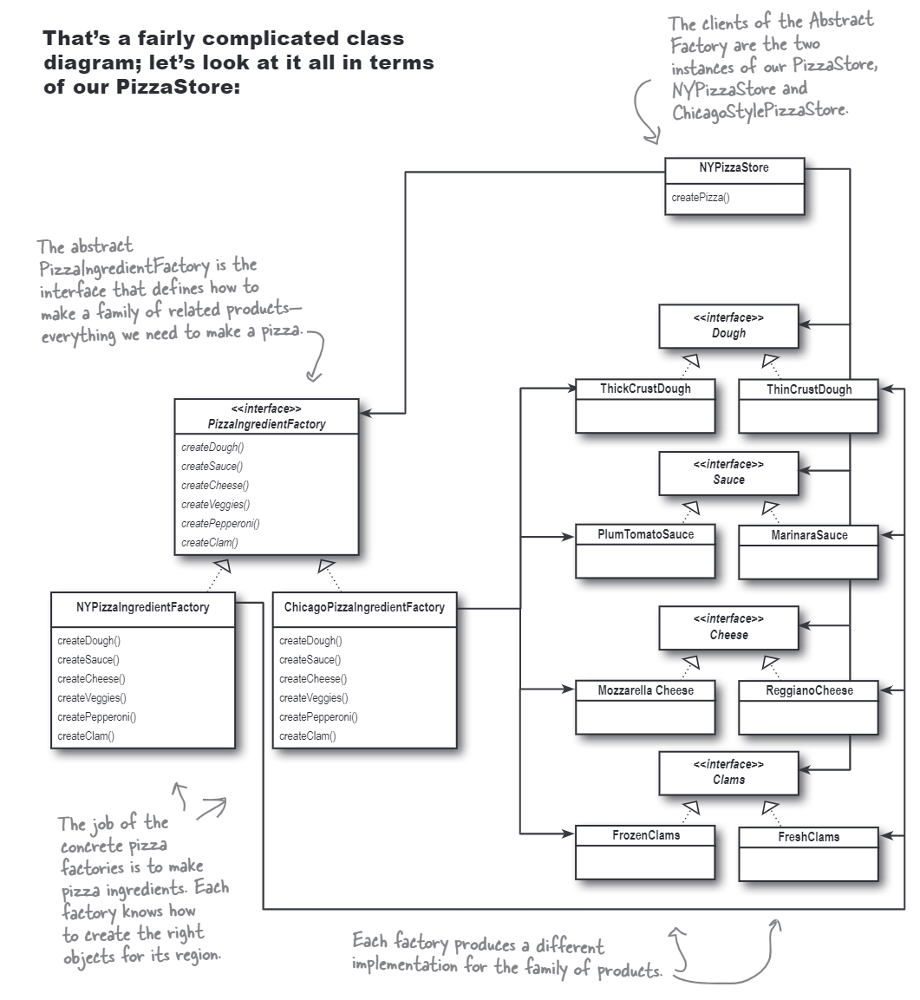

# The Abstract Factory Pattern
In this case, different stores will use different ingredients to make their pizzas. We can use the abstract factory pattern to create a factory for each store, and each factory will create the ingredients needed for the store to make the pizza.

The class diagram is shown below:

