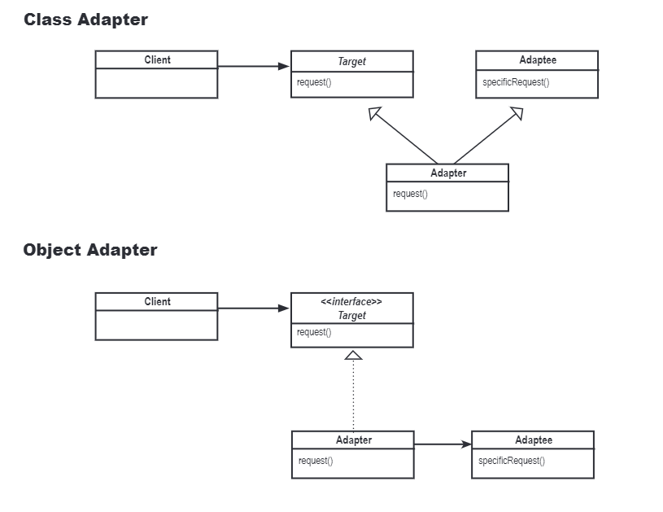

# The Adapter Pattern
In this case, we use the adapter pattern to make a `Turkey` can be seen as a `Duck`. The `Turkey` is a class that has a method `gobble()` and `fly()`, and the `Duck` is a class that has a method `quack()` and `fly()`. We want to make the `Turkey` can be seen as a `Duck` by using the adapter pattern. The key point of the adapter pattern is to make the `Turkey` can be seen as a `Duck` by using the adapter class `TurkeyAdapter`. The `TurkeyAdapter` is a class that has a method `quack()` and `fly()`, and it has a `Turkey` object as a member variable. The `TurkeyAdapter` class will call the `gobble()` and `fly()` method of the `Turkey` object in the `quack()` and `fly()` method of the `TurkeyAdapter` class. So, the `Turkey` can be seen as a `Duck` by using the adapter pattern. The intention of the adapter pattern is to make the `Turkey` can be seen as a `Duck` by using the adapter class `TurkeyAdapter`. This is different with the facade pattern, which is to provide a simple interface to a complex system.

There are two ways which can implement the adapter pattern, their class diagrams are shown below (inheritance versus composition):

