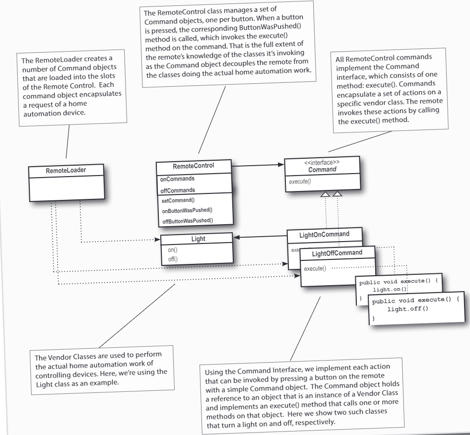

# The Command Pattern
In this case, we are going to design a remote controller to control some devices. The remote controller has some buttons, each of which is used to control a device. The remote controller has some slots, each of which is used to store a command. When a button is pressed, the corresponding command is executed. The remote controller has an undo button, which is used to undo the last command. The remote controller also has a party button, which is used to execute a sequence of commands in a party mode.

The class diagram is shown below:

