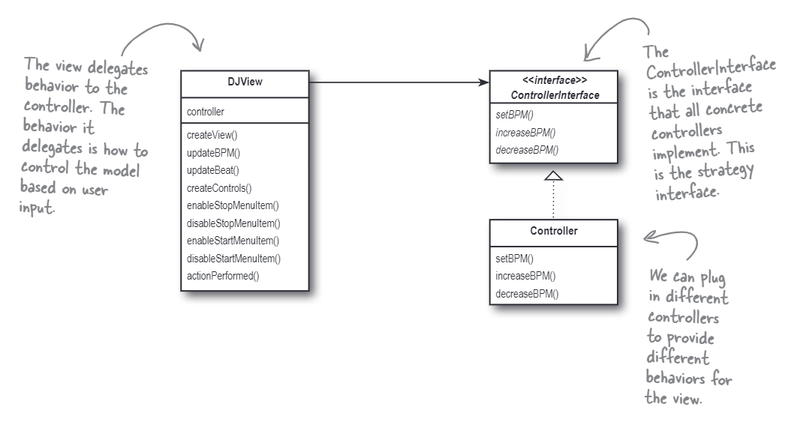

# The MVC pattern
The most famous common pattern related with the compound pattern is the MVC pattern. The view can
be seen as a composite of the model and the controller. And the view and the model use the observer
pattern to keep in sync. The controller is the mediator between the view and the model.

The class diagram is shown below:

