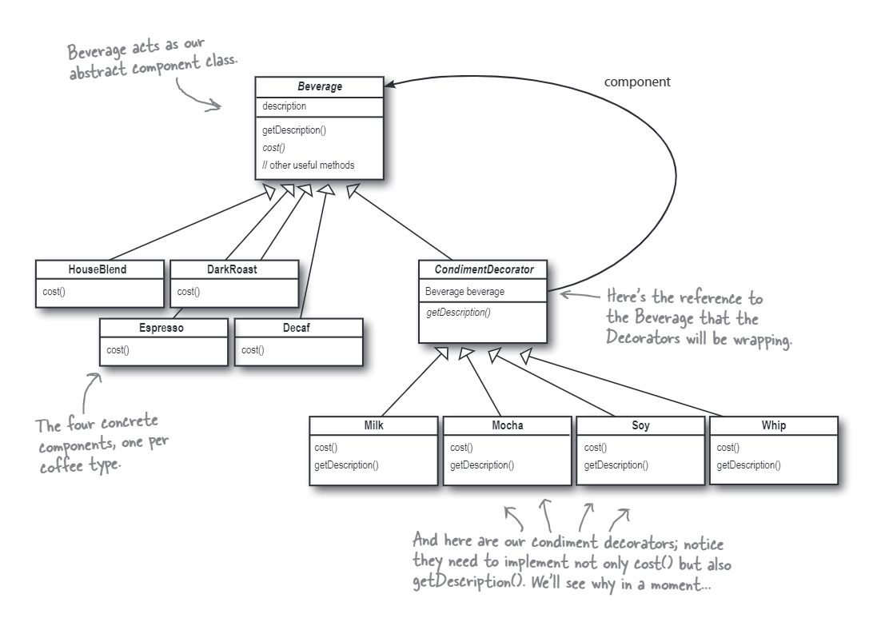

# The Decorator Pattern
In this case, we'll design classes for a coffee shop. We'll have a base class for the beverages, and then we'll have a decorator class for each condiment that can be added to the beverage. The decorator class will have a reference to the beverage object it is decorating. The decorator class will also be a subclass of the beverage class, so it will have the same interface as the beverage class. The decorator class will add its own cost to the cost of the beverage it is decorating.

The class diagram for the decorator pattern is shown below:

