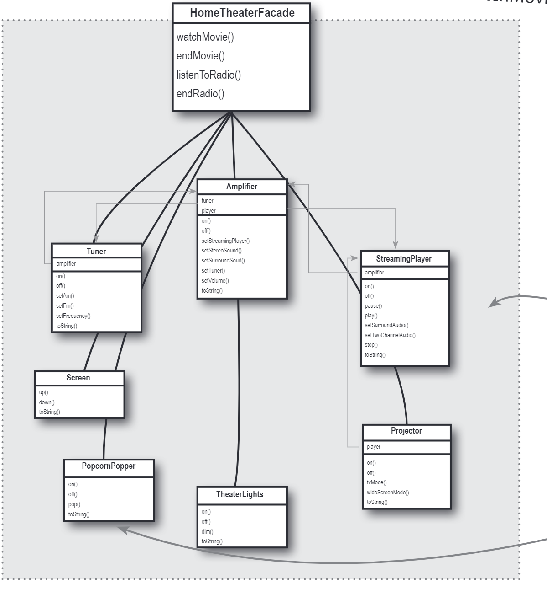

# The Facade Pattern
In this case, we'll use the facade pattern to simplify the process of movie watching.
The facade pattern is a structural design pattern that provides a simplified interface to a library,
a framework, or any other complex set of classes. The facade pattern is typically used when a system
is very complex or difficult to understand because the system has a large number of interdependent
classes or its source code is unavailable. The facade pattern hides the complexities of the larger
system and provides a simpler interface to the client. It typically involves a single wrapper class
that contains a set of members required by the client. These members access the system on behalf of
the facade client and hide the implementation details.

The bleow is the class diagram of the facade pattern:

