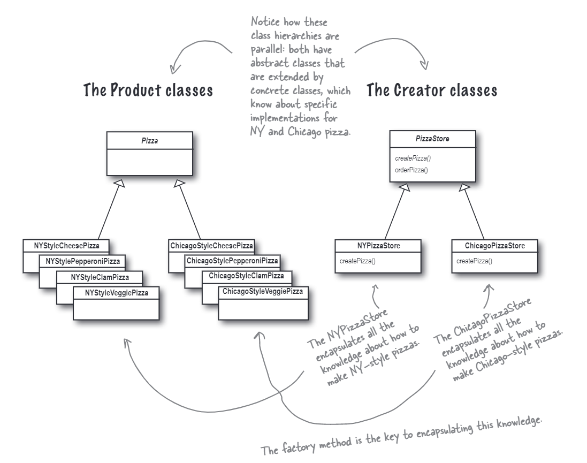

# The Factory Method Pattern
In this case, we use the factory method pattern to create a factory that can create different types of products. The factory method pattern is a creational pattern that uses factory methods to deal with the problem of creating objects without specifying the exact class of object that will be created. This is done by creating objects by calling a factory method—either specified in an interface and implemented by child classes, or implemented in a base class and optionally overridden by derived classes—rather than by calling a constructor.

The class diagram is shown below:

