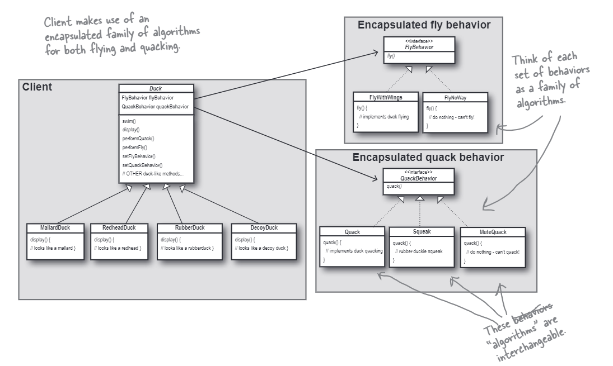

# Intro -- The Strategy Pattern
This is for the intro part of `Head First Design Patterns`, which requires to design a `Duck` class. The `Duck` class can fly, swim, quack, and display. But some sub-class, such as `RubberDuck` cannot fly and will squeak instead of flying and quacking. Therefore, there is a need to partition the fly and quack parts. They becomes interfaces or abstract classes in `C++`. And the `Duck` class now has too member fields: `flyBehavior` and `quackBehavior`. Different implementations of these two fields will lead to different performances. For `RubberDuck` you can use an object of `FlyNoWay` to initialize the `flyBehavior` and an object of `Squeak` to initialize the `quackBehavior`.

The class diagram from the book:

This pattern is also known as the `strategy pattern`.
