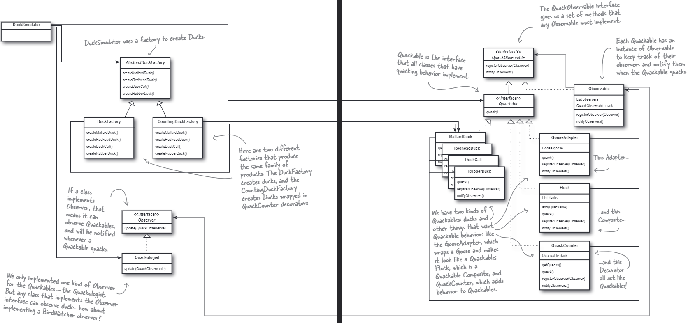

# Multi-Pattern
In this section, we just use more than one pattern to solve the problem. We use the adapter pattern
to adapter the goose to the duck. We also use the composite pattern to combine ducks to make them a
flock. Then we use the decorator pattern to decorate the ducks with quack counter. We use the
factory pattern to create the ducks and the flock. Finally we use the observer pattern to observer
the ducks and the flock.

The class diagram is shown below:

