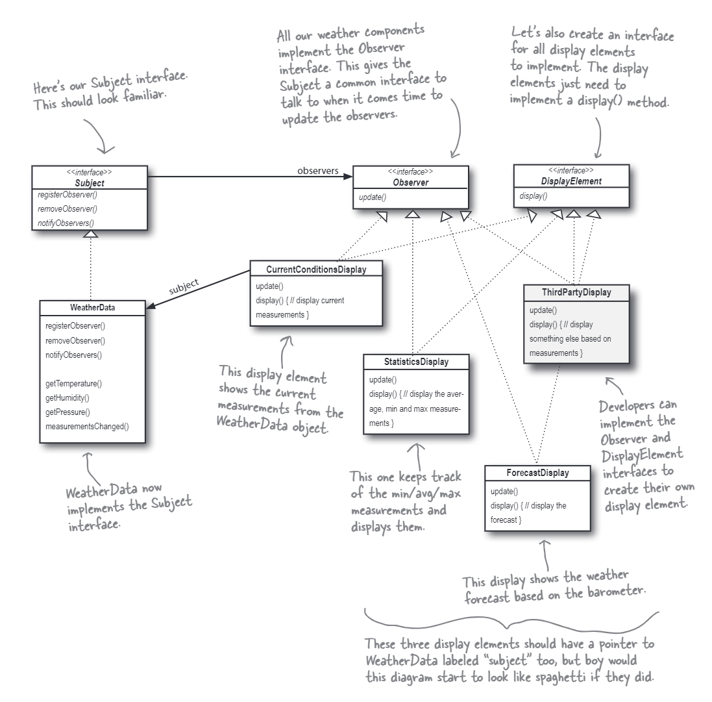

# The Observer Pattern
In the example, we'll use the `observer pattern` to finish the weather application which can show different weather data. The `observer pattern` defines a one-to-many dependency between objects so that when one object changes state, all its dependents are notified and updated automatically. We have a `WeatherData` class, which is a subject. It has three observers: `CurrentConditionsDisplay`, `StatisticsDisplay`, and `ForecastDisplay`. The `WeatherData` object will notify these observers when the weather data has been updated. Besides, the `WeatherData` object is a sub-class of `Subject`, and the observers are sub-classes of `Observer`. All the observers implement the `update` method, which comes from the `Observer` class, to update their data when they are notified. All the observers have a method called `display`, which comes from the `DisplayElement` class, to display their data.

The class diagram is shown below:

The `update` in the `Observer` class is fixed in the `push` type code. Therefore once you want notify with different data, you have to update all the observers. This is not a good design. We can use the `pull` method to solve this problem. The `pull` method is to let the observer get the data from the subject. The `push` method is to let the subject push the data to the observer. The `pull` method is more flexible than the `push` method. The `push` and `pull` methods are both given in the code. By default the `pull` method is used. You can update the comments to use the `push` method in `notifyObservers` method.

NOTE:
> There is something different with `Java` in the `C++` implementation. Because, we've used `std::shared_ptr` to control the objects, we can not register the observer in the constructor or remove the observer in the destructor (this can be done by using the pure pointers but it is not recommended by the modern `C++` programming). So, we have to use the `registerObserver` method to register the observer. And we have to use the `removeObserver` method to remove the observer. The `setMeasurements` method is used to update the weather data and notify the observers.
