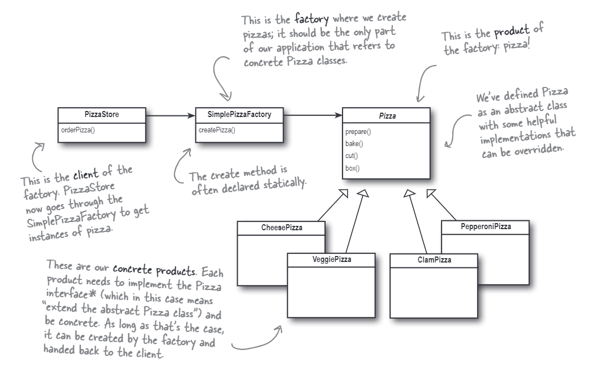

# The Simple Factory
Note that the simple factory is not a design pattern, but a programming idiom. It is a way to create objects without exposing the creation logic to the client and refer to the newly created object using a common interface.

In this case, we are running a pizza shop and we have different types of pizzas to support. We can create a simple factory to create the pizzas for us. The simple factory is a class that has a method that creates objects. The client does not need to know the class of the object that is created. The factory decides which class to instantiate. We can make the method static so that we do not need to instantiate the factory class.

The class diagram of the simple factory is shown below:

