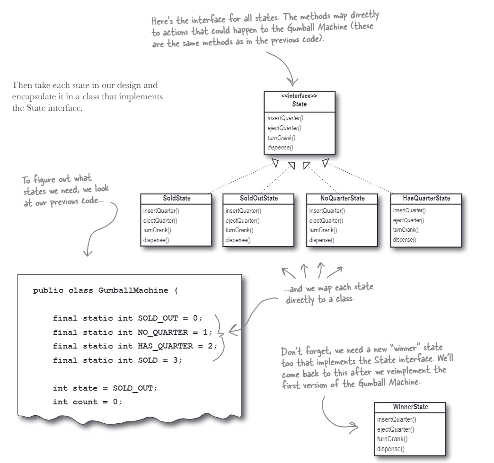

# The State Pattern
The state pattern is very like the state machine. It is a behavioral design pattern that allows an object to change its behavior when its internal state changes. The object will appear to change its class.

The class diagram is shown below:

