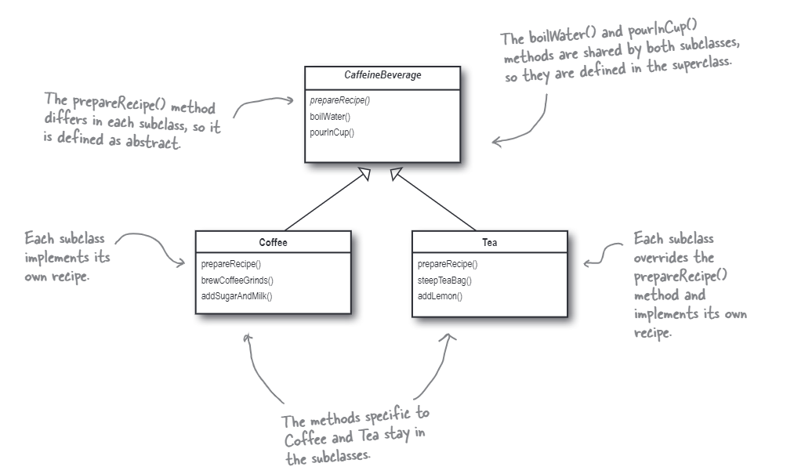

# The Template Method Pattern
In this case, we are going to use the template method pattern to solve the process of beverage making. We figure out that every beverage's process of making can be divided into three parts:
* prepare the recipe.
* boil the water.
* pour the beverage into a cup.

So we can use the template method pattern to solve this problem. We define the template method in the abstract class and let the subclass implement the specific method.

The class diagram is as follows:

